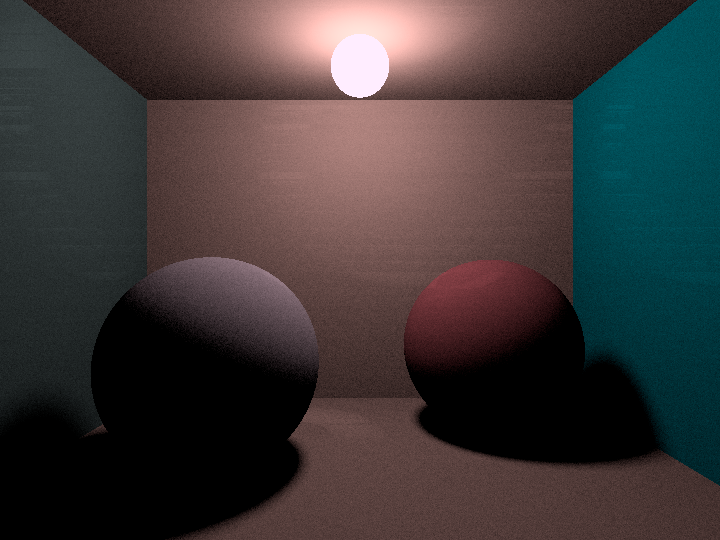
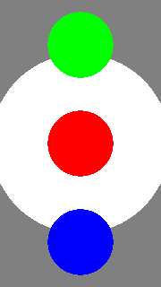

# レンダラー実装編 #1

今回からシンプルなレンダラーを実装していきます 。
目標はこんな感じのシーンを表現します。



## 今回の実装目標

今回はここまでを目標にします。



## 実装すること

実装するのは大きく分けて以下の３つです。

* Renderer
* Image
* Body

## 各クラスについて

### Renderer

このクラスはレンダリングを担当するクラスです。カメラやシーン内に存在するオブジェクト（Body）を管理しています。

```cpp
class Renderer {
    std::vector<Body> bodies;
    Camera camera;
    Color bgColor;

    Image render();
};
```

### Image

このクラスは画像データを管理するクラスです。

```cpp
class Image {
    int width;
    int height;

    Color *pixels;
}
```

### Body

このクラスはシーン上に設置するオブジェクトのクラスです。
形状（球）や色を持っています。

```cpp
struct Body {
    Sphere sphere;
    Material material;
}
```

## レンダリングの大まかな流れ

1. カメラ、フィルム、オブジェクトをシーン内に設置する
2. カメラからフィルムの各ピクセルに向けてレイを飛ばし、輝度の計算をする
3. Imageクラスに計算した輝度を記録し、出力する


以上の流れを簡単な疑似コードにすると以下のようになります。
（実際の実装とは異なります。）

```cpp
Image Render() {
    /// カメラやオブジェクトをシーン内に設置する
    renderingPrepare();
    /// 出力用のImageを用意
    Image image;
    /// フィルム上のピクセル全てに向けてレイを飛ばす
    for(imageの全てのピクセル) {
        Ray = カメラからピクセルの中心に向けたRay;
        if(Rayがオブジェクトと衝突したか) {
            /// オブジェクトに当たった場合
            ピクセルの色 = 衝突したオブジェクトの色;
        } else {
            /// オブジェクトに当たらなかった場合
            ピクセルの色 = 背景色;
        }
    }
  
    return image;
}
```

## レイとオブジェクトの衝突判定

今回の肝となる衝突判定について見ていきましょう。
オブジェクトの形状には三角形、四角形などがありますが、この勉強会では比較的簡単に実装できる球を扱っていきます。

### レイの定義

レイは以下の式で表現されます。

$$
\bm{P}(t)=\bm{o}+t\bm{d}
$$

ここで$\bm{o}$はレイの原点で、$\bm{d}$は方向を表すベクトルです。使いやすくするために長さは0になるように正規化します。

$t$はレイの長さを表すスカラーとなります。実用上ではオブジェクトとレイの衝突距離が主な使用用途となります。

$t$が変化することによって計算される座標がレイの通る道となります。

#### レイの構造体

```cpp
struct Ray {
    Eigen::Vector3d org;
    Eigen::Vector3d dir;
};
```

### 球の定義

球は以下の式で表現されます。

$$
(P_x-C_x)^2+(P_y-C_y)^2+(P_z-Cz)^2=R^2
$$

ここで$\bm P$はある点を表し、$\bm C$は半径$R$の球の中心を示しています。

もし点$\bm P$が球上にあるならこの式が成立します。もうすこし簡単に表記するために内積を使用します。

球の中心$\bm{C}$から点$\bm P$までへのベクトルは$(\bm P-\bm C)$で表現できるので、

$$
(\bm P-\bm C)\cdot(\bm P-\bm C)=(P_x-C_x)^2+(P_y-C_y)^2+(P_z-Cz)^2
$$

となります。したがってベクトルを用いた球の方程式は

$$
(\bm P-\bm C)\cdot(\bm P-\bm C)=R^2
$$

となります。

#### 球のクラス

```cpp
class Sphere {
    double radius;
    Eigen::Vector3d center;
};
```

### レイと球の衝突判定

レイと球の衝突判定をするにはレイの通り道であり、球上であるような点が存在することを確かめなければなりません。その点というのはレイの方程式より$t$で表現できるので、レイと球の方程式の$t$に関する連立方程式を解く必要があります。

$t$に求める条件は以下の２つです。

1. $t$が存在する
2. $t>0$であること

1は当然として、2はどうしてでしょう。それはレイの飛ばす方向にあります。$t<0$であればレイは後方へ飛んでいることになります。よって$t$は正でなければなりません。


ではレイと球の連立方程式を解きましょう。

$$
\bm{P}(t)=\bm{o}+t\bm{d}\\
(\bm P-\bm C)\cdot(\bm P-\bm C)=R^2
$$

レイの方程式を球の方程式に代入すると、

$$
(\bm o+t\bm d-\bm C)\cdot(\bm o+t\bm d-\bm C)=R^2
$$

となり、この式を展開すると以下のように$t$についての二次方程式となります。

$$
t^2\bm d\cdot\bm d+2t\bm d\cdot(\bm o-\bm C)+(\bm o-\bm C)\cdot(\bm o-\bm C)-R^2=0
$$

衝突判定をするには、この二次方程式の解が存在するかどうかを調べればよいことになります。

したがって判別式を考えればよく、また一次の係数が偶数であるので、以下のように簡単に書けます。

$$
a=\bm d\cdot\bm d\\
b'=\bm d\cdot(\bm o-\bm C)\\
c=(\bm o-\bm C)\cdot(\bm o-\bm C)-R^2
$$

$$
\frac{\bm D}{4}=b'^2-ac
$$

また、同じベクトルの内積はベクトルの長さの二乗に等しく、$\|d\|=1$なのでより簡単に書けます。したがって判別式は

$$
\frac{\bm D}{4}=b'^2-c
$$

となります。

次に$t$は二次方程式の解の公式より、

$$
t=-b'\pm\sqrt{D}
$$

と計算できます。このとき$t>0$を満たしていて小さい方を解として採用します。小さい方が先に球と衝突するからですね。

したがって以上を擬似コードにすると、

```cpp
hit(Ray, Sphere) {
    b = (Rayの原点-Sphereの中心)とRayの方向ベクトルとの内積;
    c = (Rayの原点-Sphereの中心)の二乗ノルム - Sphereの半径の二乗;
    D = b*b - c;
    t1, t2 = -b - sqrt(D), -b + sqrt(D);
    if(D >= 0 && t1とt2の少なくとも1つが0より大きい) {
        if(t1 > 0) return true, t1;
        else return true, t2;
    }
    return false;
}
```

### 衝突判定（補足）

今後に向けて、衝突判定の関数に追加することがあります。ただメインではないので今回で完全に把握する必要はありません。

#### 衝突点の法線の計算


後々レンダリング方程式を解いて輝度を計算する必要が出てきます。そのためには衝突点の法線が重要になります。

球の衝突点における外向き法線は球の中心$C$から交点$P$へのベクトルと同じ方向を持つ。よって法線の長さを$1$にして考えると、

$$
outwardNormal=\frac{(\bm P-\bm C)}{\|\bm P-\bm C\|}
$$

となります。また、レイは球の内側から衝突するかもしれません。球の内部にレイの原点があった場合、内側から当たりますよね。そのときは球に対して内向きの法線でなければなりません。

その判定にはレイの方向ベクトルと外向き法線の内積を見ます。このとき内積が$0$以上であれば内側から当たったということになるので内向きの法線を計算しましょう。計算自体は向きを反転させてあげればいいだけなので、$-1$をかけてあげましょう。


### Hit構造体

さて、衝突判定をするときには今後のレンダリングで必要な情報を多く処理することになります。これらすべてを保持する構造体が必要です。なぜなら関数は一つしかデータを返せないからです。hit関数では基本的にレイとオブジェクトが当たったか、当たってないかのbooleanを返します。そのため別の方法でデータの受け渡しをします。

Hit構造体を関数に渡してあげることで、その中に各種計算結果を代入します。

Hit構造体は以下のメンバ変数を持っています。

```cpp
struct RayHit {
    int idx;
    double t;
    Eigen::Vector3d point;
    Eigen::Vector3d normal;
};

```

idxはオブジェクト固有の番号です。シーン上にいくつもオブジェクトが存在する場合、識別する必要が出てくるからです。

## シーン上のオブジェクト全体に衝突判定を実行する

カメラからレイを飛ばして、当たったオブジェクトの色でフィルムに色付けをしていくことで画像は完成します。このとき、シーン上に複数オブジェクトが存在するなら、全てのオブジェクトに対して個別に衝突判定をします。そのなかで複数のオブジェクトがレイと衝突したと判定されることもあります。衝突判定時にはその他のオブジェクトを考慮しないからです。

レイと衝突したと判定したいのは一番近くにあったオブジェクトですから衝突距離$t$のなかで最小距離のオブジェクトを探索します。 


以下が擬似コードとなります。

```cpp
hitScene(Ray, Hit) {
    Hit.t = 限りなく大きい値;
    for(body : すべてのオブジェクト bodies) {
        if(bodyとRayが衝突した && 衝突距離tがHit.tより小さい) {
            Hit.t = t;
            Hit内部のその他の情報を現在のオブジェクトとの衝突判定の結果に更新;
        }
    }
  
    return 少なくとも一度オブジェクトに衝突した?
}
```
